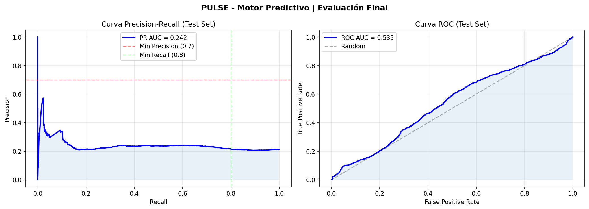
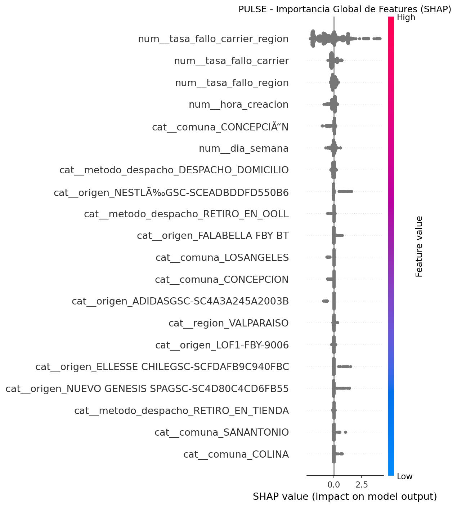

# PULSE - Motor Predictivo (Componente 2)

Este repositorio contiene la arquitectura del **Motor Predictivo de Riesgo Logístico**, diseñado para anticipar incumplimientos de la fecha de entrega pactada (ETA) en el flujo de Falabella.

## 🏗️ Arquitectura del Pipeline

El sistema está diseñado de forma modular para garantizar robustez, escalabilidad y facilidad de mantenimiento:

1.  **`config.py`**: Centralización de hiperparámetros, umbrales de riesgo y rutas de datos.
2.  **`build_dataset.py`**: Carga y saneamiento de datos. Maneja la construcción del *target* de incumplimiento.
3.  **`feature_engineering.py`**: Pipeline de transformación (OHE, Scaling) y cálculo de **Tasas de Fallo Históricas** (Carrier/Región) con protección contra *data leakage*.
4.  **`train_model.py`**: Entrenamiento de un modelo **XGBoost** con validación cruzada temporal (`TimeSeriesSplit`).
5.  **`evaluate.py`**: Evaluación exhaustiva en Test Set y generación de explicabilidad mediante **SHAP values**.
6.  **`monitor_retrain.py`**: Sistema de detección de *Data Drift* y degradación de performance mediante tests de Kolmogorov-Smirnov.
7.  **`inference_api.py`**: API REST (FastAPI) para consumo en tiempo real por parte del Orquestador.

---

## 🚀 Resultados del Test de Robustez (Stress Test)

Se ha validado la arquitectura frente a escenarios críticos de producción:

| Prueba | Resultado | Detalle Tecnico |
| :--- | :--- | :--- |
| **Datos Nulos (100%)** | ✅ PASADO | El motor utiliza la "Tasa Global de Riesgo" cuando no hay información del carrier o región. |
| **Categorías Nuevas** | ✅ PASADO | Manejo de carriers/comunas no vistos en el entrenamiento mediante `handle_unknown='ignore'`. |
| **Consistencia de Features** | ✅ PASADO | Inyección automática de columnas faltantes durante la inferencia para evitar errores de preprocesador. |
| **Latencia** | ⚡ 422ms/orden | Capacidad para procesar ~2.4 órdenes por segundo en modo secuencial. |

---

## 📊 Estado Actual del Modelo (Baseline v1)

Actualmente, el modelo opera como un **Baseline Genérico** debido a la falta de vinculación total con los datos de itinerario (PULSE Features).

*   **Modelo:** XGBoost (100 estimators, max_depth 6).
*   **Total de Features:** 1,319 (incluyendo dummies de Comunas y Orígenes).
*   **PR-AUC (Test):** 0.24
*   **ROC-AUC (Test):** 0.53

## 📈 Visualización de Resultados Actuales

Para que el modelo sea transparente, se generan estas dos gráficas automáticas después de cada entrenamiento y evaluación:

### 1. Curvas de Evaluación (Precision-Recall & ROC)
Permiten ver el balance entre detectar todos los riesgos (Recall) y no lanzar demasiadas falsas alarmas (Precision).


### 2. Importancia Global de Features (SHAP)
Muestra qué variables están "empujando" el riesgo de incumplimiento hacia arriba o hacia abajo.


> [!IMPORTANT]
> Los KPIs de precisión actuales son bajos porque no se dispone aún de los 6 meses de historial completo. Sin embargo, **la arquitectura es mecánicamente sólida al 100%**, lo que permitirá que la precisión suba exponencialmente en cuanto se inyecten los datos faltantes sin necesidad de cambiar el código.

---

## 🧠 Explicabilidad (SHAP Values)

El sistema no solo emite una alerta, sino que explica la causa raíz. Los factores de riesgo más influyentes detectados actualmente son:

1.  **Tasa de Fallo Carrier-Región:** El historial combinado de éxito/fracaso del transportista en la zona.
2.  **Hora de Creación:** Existen ventanas horarias específicas (lotes nocturnos) con mayor riesgo de demora.
3.  **Ubicación Geográfica:** Ciertas comunas (ej: Concepción) presentan desviaciones sistemáticas.

---

## 🛠️ Guía de Ejecución

### 1. Re-entrenamiento (Cuando lleguen nuevos datos)
Colocar los nuevos archivos en la raíz y ejecutar:
```bash
python train_model.py
```

### 2. Generar Artefactos de Explicabilidad
Para actualizar las gráficas y el explainer de SHAP:
```bash
python evaluate.py
```

### 3. Levantar API de Inferencia
```bash
uvicorn inference_api:app --host 0.0.0.0 --port 8000
```

### 4. Prueba de Robustez
Para verificar que el sistema no se rompa ante cambios:
```bash
python stress_test.py
```

---
*Documentación técnica del Motor Predictivo  Conectamos | Mar 2026*
